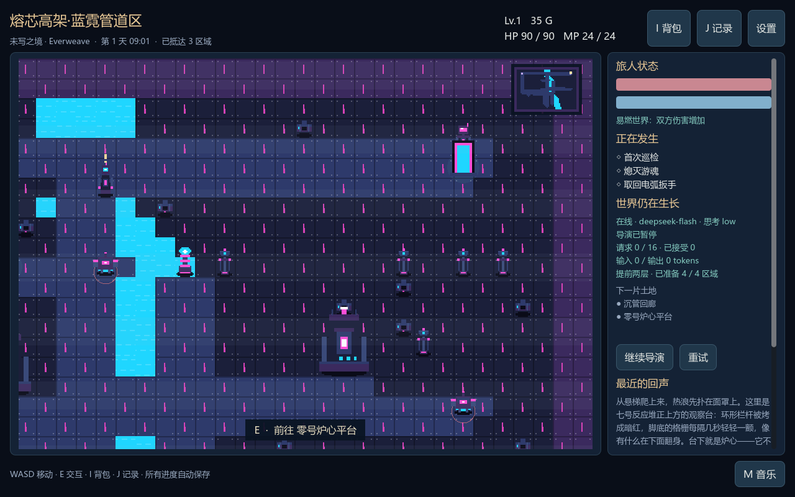
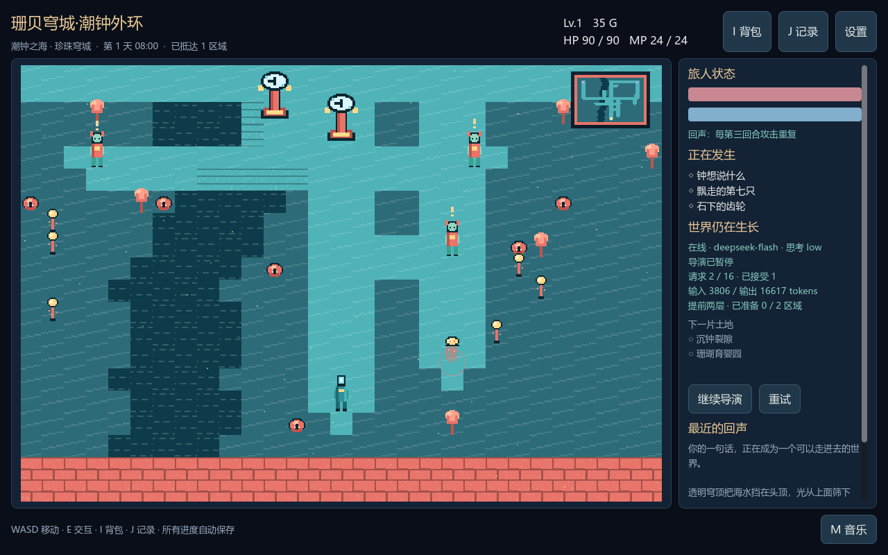

# Everweave · 未写之境

**一句世界设定，进入一款在游玩时持续被 LLM 创作的像素 JRPG。**

这不是“让 AI 写好一款游戏后再玩”，也不是带立绘的聊天窗口。你实际在地图里移动、调查、开箱、买卖、装备和回合制战斗；重要选择、发现与胜利会反馈给同一个导演模型，改变正在发生的事及尚未抵达的区域。

**当前状态：Content Runtime v2 源码原型，尚不是完整发行游戏。** 已接入统一格式纠正、按作用域解析 ID 与引用、完整错误位置和按地区重试，并完成 Windows / Godot 原生测试及真实 DeepSeek 下一地区联调。见 [最新协议与验收记录](docs/PROTOCOL_RELIABILITY.md)；最初的 v2 源码包记录保留在 [历史交付记录](docs/REFRACTOR_TEST_REPORT.md)。

此前 v1 的 Windows、99 项测试与真实 DeepSeek 记录保留在 [引擎验收记录](docs/ENGINE_REVIEW.md) 和 [图形与预生成记录](docs/VISUALS_AND_PREFETCH.md)，不作为 v2 在线生成成功的证据。

| 太空机械城 | 海底珊瑚城 |
|---|---|
|  |  |

> 图为真实 DeepSeek 生成绘图数据后，由本机 Godot 渲染的画面。测试存档、模型响应和凭据不随仓库上传。

## Content Runtime v2 更新

**在线生成现在必须同时创作空间蓝图与可执行规则，不再只给固定玩法换名字。**

地图尺寸、房间、道路、对象锚点和原创地表由模型决定；通用对象可有状态、条件与自定义操作；任务可由任意受支持的条件组合完成；战斗按钮来自模型定义；当前地图可在事件后改变。新增动画帧、主角身份复用及设计历史反馈。

按 **F** 打开自定义操作，按 **.** 等待；相邻对象仍用 **E** 交互。自定义战斗用 **1–9**，**Esc** 撤离。启动方式不变，建议重新生成一个世界体验新协议；旧存档不会被强制重建。

详细能力、语法和未实现边界见 [EXECUTABLE_CONTENT.md](docs/EXECUTABLE_CONTENT.md)。以上旧版本的实机截图记录证明的是此前版本，新增内容的实际验证范围见本轮验证记录。

## 启动（Windows）

需要 **Godot 4 Standard**（目标版本 4.7.2）和 **Python 3.11+**。正常游玩不需要 pip、Node、Docker、数据库安装或其他 AI 服务。运行游戏只需要这两个程序；Godot 安装包没有放进项目里。

解压后，将官方 Godot `.exe` 放到本目录，双击 `Start.cmd`。也可以在 PowerShell 7 里指定路径：

```powershell
.\Start.ps1 -Godot 'Godot_v4.7.2-stable_win64.exe'
```

或跨平台命令：

```text
python launch.py --godot /path/to/godot
```

启动器会导入素材，启动一个仅监听本机回环地址的 Python 状态引擎，再打开 Godot。退出游戏时一并停止。**不需要手动维护两个服务。**

进入标题界面后写一句设定，选择：

- **DeepSeek · 在线生成**：默认入口。输入一句设定后，模型从空世界创建内容，并根据玩家行动持续扩展。启动器已有本地密钥时，API Key 框可留空。
- **其他兼容服务 · 在线生成**：填写自己的接口、模型与密钥，需支持 Chat Completions + JSON mode。
- **引擎自检 · 离线样例**：只用于检查安装和操作，完全不调用模型。选择后隐藏所有模型设置，与在线模式互斥。

服务选择、地址、模型与调用上限会保存；重启后需点击“应用配置并继续”才会恢复模型调用。

**思考等级默认 `low`**。DeepSeek 可选 `low / high / max / 关闭思考`；其他兼容服务可选该服务支持的等级，也可选择“服务默认”省略参数。思考等级会保存，应用配置后用于后续生成。DeepSeek 请求明确启用 thinking 并传递 reasoning_effort；只将最终 JSON 应用到世界，思考文本不进入游戏内容或存档。

密钥在图形界面输入即可，不要写进代码或存档。也可通过本机的 `DEEPSEEK_API_KEY` 环境变量提供。交接后界面的密钥框会清空；同进程、同接口地址重新配置时复用内存中的密钥。

**只有一个存档槽**。已有存档时，可用“应用配置并继续”恢复当前世界；想重新开始时，修改世界设定，点击“重新生成世界”，再在弹窗中点击“开始新世界”。取消会保留原世界，确认会替换现有世界与进度。运行时保存于 Windows 的 `%LOCALAPPDATA%\EverweaveJRPG`，Linux 的 `$XDG_DATA_HOME/everweave-jrpg`（默认 `~/.local/share/everweave-jrpg`），不在仓库里。不要同时开两个实例编辑同一槽。

### 操作

| 操作 | 按键 |
|---|---|
| 移动 | WASD / 方向键 |
| 与相邻对象交互、经过出口 | E / Space；也可点击相邻对象 |
| 背包：使用药剂、装备武器或护符 | I |
| 查看事件和未解故事线 | J |
| 关闭面板 / 返回设置 | Esc |
| 攻击、星火术、防御、药剂、撤离 | 战斗中按 1–5，或按钮 |
| 音乐开关 | M |

NPC 上方有金色标记；敌人脚下有红圈；两个上方出口通向新区域，下方出口返回来路。若道路尚未生成，可继续在当前地图活动，并在右侧查看状态。普通战斗、走路、开背包、浏览已经生成的对话不需要即时模型回答。

## 已实现的游戏与生成链路

```text
一句话设定 → LLM 区域蓝图 → 严格校验 → 程序铺图 + 像素素材 → 真正可走的地图
                                        ↑
玩家的选择 / 开箱 / 胜利 → 结构化事件 → 同一个 LLM
                                        ↓
            当前区域补丁 + 故事线 + 对相邻未访问区域的重新创作
```

- **持续生成**：滚动提前两层，自动覆盖每一个出口及出口之后的下一层。切换区域后自动补齐新的两层范围；同一个模型最多两路并发，实际请求仍受总调用上限约束。
- **实际改变世界**：导演能在同一反应补丁中新增物品、实体、任务与地点入口；名称和描述由模型创作，引用校验、注册、摆放和存档由引擎执行。
- **可玩系统**：碰撞移动、相邻交互、怪物遭遇、回合制战斗、伤害/状态、经验升级、药剂、装备、商店、委托、宝箱、存档和回访。
- **规则真的生效**：静默区域禁用魔法；治愈之雨恢复生命；易燃区域提高双方伤害；回声法则每第三回合重复玩家攻击。
- **控制成本**：一个模型、最多两个在途请求、调用间隔、总调用上限、最多一次 JSON 修复。网络失败停止这个任务，需手动重试；没有自动烧钱循环。
- **主题图形**：模型为新区域提供原创像素绘制数据，决定角色、建筑、装饰的形状与配色；Godot 本地编译成纹理，地图和战斗共用。无需等待文生图。原来的图集仅用于旧存档及离线自检。

### 成本不隐藏

一次选择可以引起当前地区反应与未访问草案的后台刷新。已准备的地图在刷新完成前仍可进入；不会因开箱或选项被清空。两层预生成会多使用请求与 token，所有实际云请求都计入上限，默认每次启动最多 60 次。图形生成也由同一模型完成；第一次铺好缓冲仍需等待服务响应。

暂停只阻止新请求，已发出的请求可能继续完成。达到上限、服务超时或离线时，既有地图仍然可玩，但尚未生成的出口不会谎称已经准备好。

## 架构与边界

Godot 是真正的图形客户端；一个 Python 标准库本机进程负责权威状态、存档、地图编译和模型请求。这样不用在 Godot 中复制第二套游戏规则，也能对存档、边界和持续生成做自动化测试。它不是云端后台。

```text
client/          Godot UI、图块/精灵渲染、输入、天气、战斗舞台
engine/world.py  权威游戏状态与行动结算
engine/scene.py  模型空间蓝图 → 精确 Tile 网格与对象占地
engine/runtime.py  有界规则解释器：状态、条件、事件、目标
engine/gameplay.py  玩家动作与生成规则的原子结算
engine/pcg.py    旧存档与离线自检的兼容地图施工
engine/schema.py 受限 JSON 语言与引用/预算校验
engine/director.py 单模型调度、提前准备、过期响应丢弃、有限修复
engine/storage.py  SQLite 原子快照；地图在内存中只缓存 6 张
engine/server.py  仅回环地址、每次启动随机令牌的本机桥接
assets/          原创素材，不需要在线下载
```

状态规则和模型协议见 [ARCHITECTURE.md](docs/ARCHITECTURE.md)。安全边界见 [SECURITY.md](docs/SECURITY.md)。

**本原型的边界**：一个可控人物，不是完整多人小队；地形图块与机制字典有限；支持同地图房间，但没有完整的独立楼层/室内编辑器；角色没有自由代码技能；不是任意美术风格生成器。生成地图、对象与剧情可以持续增加，但数据库、元数据与模型预算终究有限，不声称数学意义上的无限。

## 测试与编辑器

```text
python -m unittest discover -s tests -v
```

原生 Godot 检查（需要本机实际装有 Godot）：

```text
godot --headless --editor --path . --import --quit
godot --headless --path . --script res://tests/client_smoke.gd
```

在编辑器里打开项目并按 F6 前，先运行：

```text
python launch.py --server-only
```

开发时才需要 Pillow 来重建素材或预览；正常游玩已附全部成品素材：

```text
python -m pip install pillow
python tools/build_assets.py
python tools/render_map_preview.py
```

项目附 GitHub Actions 的核心测试和 Godot 原生冒烟检查，云端结果以仓库 Actions 页面为准。本机验证记录不代替云端 CI 状态。

## 私密源码仓库

仓库：[DDDFXYqiming/everweave-jrpg](https://github.com/DDDFXYqiming/everweave-jrpg)。本地 `origin` 指向此私密仓库。

后续更新使用正常的 `git commit` 和 `git push`。`Publish-Private.ps1` 保留为首次建库工具，会验证账号及私密状态，并拒绝覆盖已有非空仓库。

只检查上传白名单，不写入 GitHub：

```powershell
.\Publish-Private.ps1 -DryRun
```

密钥、个人存档、模型响应日志、压缩包及 Godot 二进制均不属于上传内容。

## 上游接口依据

目标引擎：[Godot 4.7.2 官方归档](https://godotengine.org/download/archive/4.7.2-stable/)。
模型默认值与请求接口：[DeepSeek 官方 API 文档](https://api-docs.deepseek.com/)。
思考开关与等级：[DeepSeek thinking mode](https://api-docs.deepseek.com/guides/thinking_mode/)。
