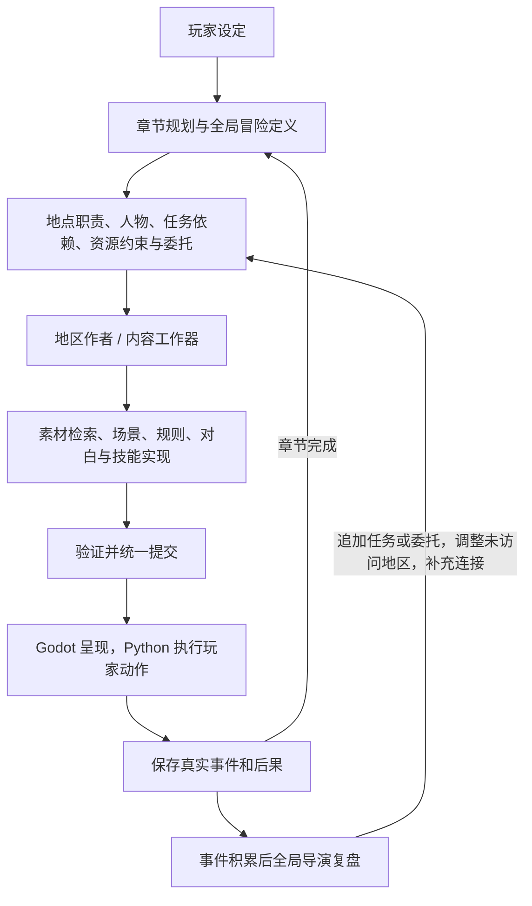

# 冒险导演与内容委托

全局创作和具体制作使用不同任务、上下文与提交权限，仍共用同一个本机服务和模型配置。`director.py` 安排调用；`campaign.py` 管理章节；`adventure.py` 维护人物、能力、任务、结局和内容委托。事实只有一份，保存在世界 SQLite 中。

## 职责与权威状态

| 任务 | 可提交内容 | 不直接改变的事实 |
|---|---|---|
| `campaign` | 第一章游戏规格、章节图、目标、全局人物与能力简报、任务、委托、结局条件、资源收益上限 | 已有人物状态和玩家进展 |
| `direction` | 新委托、任务、条件旗标声明、未到访地区用途、当前章内补充连接 | 玩家位置、奖励、已有旗标值、已死亡人物、已到访地区设计 |
| `region` | 计划地点的空间、像素与音频、对象、局部规则、场景和技能实现 | 地点身份、全局资源规格、已经学会的技能定义 |
| 带 `commission_ids` 的 `reaction` | 为当前地区追加委托需要的定义和触发入口 | 直接重写已有对象、地图、天气、道路或 NPC 对白 |
| 普通 `reaction` | 原有的局部因果变化 | 章节图和全局事实的任意重写 |

已有局部反应仍可根据实际事件修改当前环境。委托工作器的权限更窄；奖励、学习技能、关系变化等由玩家触发的可执行规则产生。应用失败会回滚，不把半份导演决策写入世界。

同一冒险的关联分为三个视角：章节 `links` 表达空间连接；任务 `depends/when/fail_when` 表达目标依赖；稳定人物 ID、关系状态和技能 ID 表达跨地区的连续性。它们都引用同一份权威状态，不分别维护模型聊天历史作为真相。

## 全局定义

章节可提供 `campaign.adventure`。字段均有数量和类型上限，精确校验见 `engine/adventure.py`：

- `cast`：稳定 `id/name/role/motive/state`。`alive` 为布尔值，数值关系状态限定在 -100～100。人物已有名字和状态不会被再次声明覆盖。
- `skills`：稳定 `id/name/description/scope`，是制作简报。地区作者另行提供可执行能力，学习之前不会自动出现按钮。
- `missions`：`id/name/kind/region/brief/depends/when/fail_when`。类型为主线、支线或遭遇；完成与失败条件仍是章节旗标比较。依赖必须无环。支线在地点已到访且前置任务完成后才显示。
- `endings`：`id/name/description/requires/final`。前置任务完成后，在安全交互点显示一次；`final=true` 结束本局，否则可继续冒险。
- `economy`：每个资源在一次玩家事务内允许的正向收益总量。它约束规则收益，不自动发奖励，也不是完整经济模拟。新版冒险不再自动发旧战斗金币；启用成长时仍保留既有等级结算。
- `commissions`：`id/kind/region/brief/cast/skills/missions/requires/limits`。`kind` 为 `scene/encounter/quest/ability`；可指定敌人生命、攻击和数量上限。定义尚未实现、已制作和任务已完成是不同状态。

开局一次规划可声明最多 8 名人物、6 个技能、10 个任务、4 个结局和 8 个委托。后续复盘可追加，待制作委托总数最多 8；模型上下文仅带有界摘要及当前相关内容。

## 地区作者收到什么

`planned_routes` 包含当前地点的完整 `hidden/discover/requires/blocked_reason/one_way/outbound` 与 `condition_sources`，使作者知道门为什么关闭、由谁实现开门条件。这些设计资料不会进入玩家旅图。

`content_contract` 提供本地区已可制作的委托、相关人物、相关技能、已学能力、任务与资源收益上限。模型选择相容库素材、组合和原创补缺，继续使用已有素材缓存与哈希校验。

新版冒险还要求预留两个空闲可达锚点 `director_gate_0/1`。导演后续可添加最多两条连接；实际安装前再次核对锚点占用和地形可达性，不直接把墙改成门。

## 持续复盘

选择、胜利、任务进展、人物状态变化等重要事件进入复盘候选。普通查看/使用按语义去重，至少积累 8 条且距上次复盘 90 秒才复盘。普通走路不请求模型；无须调整时只返回 `reason`，不增加设计版本。

`direction` 可声明最多 6 个新旗标，初始值只能是 `false/0/"pending"`；每个新旗标需要生产地区和匹配的内容委托，整章最多 64 个旗标。可新增最多 2 个实际地点、调整最多 3 个未到访地区用途；添加地点时最多 4 条连接，否则 2 条。新地点必须有实际可达连接，整章最多 16 个地点。新任务不能把已完成条件追认为新进展。

等待中的出口和开局地区优先，附近地区至少先获得一路生成机会，再处理当前委托、重要复盘与其他预取。两路并发和请求总预算仍有效。复盘承认截至请求时的一批事件，后来的事件留给下批；应用时按当前状态验证提案。地区核对目标草案和相关人物/技能/委托依赖，相关死亡或规则冲突仍受检查。失败继续定向修复，自动最多一次。

## 人物、技能与场景

对象的 `actor_id` 绑定全局人物；第一次使用的外观固定下来，后续同一人物沿用。规则读取 `{"get":"cast.mira.trust"}`，通过 `{"op":"actor","id":"mira","key":"trust","value":5}` 修改关系。死亡状态不能用普通关系操作复活。

地区 `abilities` 使用现有动作语法。可携带技能只读玩家、资源、人物和当前战斗状态，不绑定地区变量、物体、旗标或本地物品。允许的效果为条件、数值、资源、消息与人物状态。`{"op":"learn","id":"listen"}` 才把能力交给玩家；实际规则一旦安装不可换成不同规则。跨地区继续出现 `ability:listen` 操作并正常消耗资源。

地区 `scenes` 定义 `id/title/lines/choices`，每行有 `speaker/text`，每个选择有 `id/label/when/effects`。`speaker` 为全局人物 ID 或 `narrator`。`{"op":"scene","id":"meeting"}` 在探索中打开场景；Godot 显示人物、对白和当前选项，选择时重新检查条件，再在同一事务中执行后果。新场景必须有触发入口，不能只有一份永远看不到的对白定义。

## 当前边界

这版提供持续人物身份与关系，没有完整的 NPC 行程或全世界唯一物理位置模拟。新增道路连接当前章节内已有或刚声明的地点，已生成地点仍受两个预留门口限制；跨章节走接续门。旧任务和委托不可随意取消或重写；失败的制作需要定向重试。

任务和结局条件仍较简单，不能证明所有生成冒险均可解。战斗仍以健康值和回合为基础，技能与演出能力有明确边界。场景文本、任务重复和美术质量仍需实际审查；增加结构能力不等于所有生成结果都已经好玩。验证范围见 [本轮记录](ADVENTURE_VALIDATION.md)。
