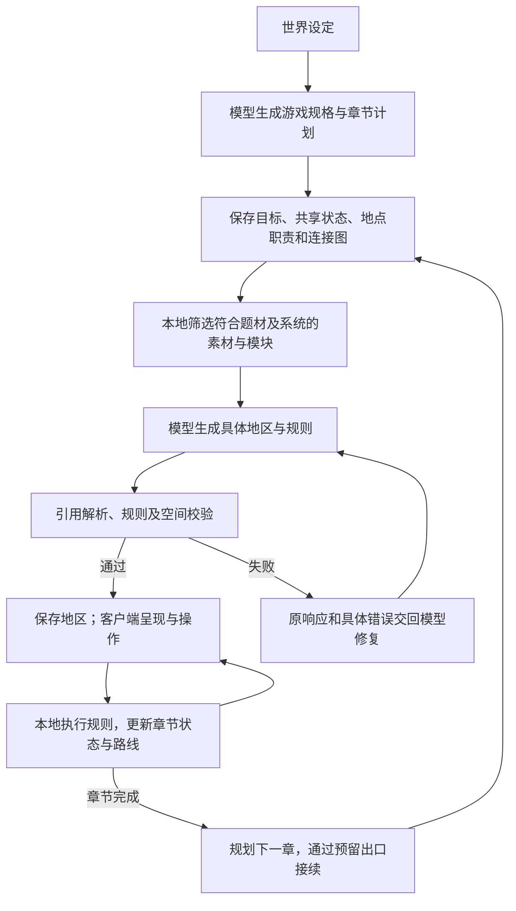

# 章节与游戏规格

本文描述当前章节实现。正常在线新世界通过 `/start` 启用规划；底层地区 DSL 仍沿用 Content Runtime v2。持续人物、内容委托与途中复盘见 [冒险导演](ADVENTURE_DIRECTOR.md)。请新建世界体验，本轮不提供旧世界转换或迁移验收。

## 从设定到冒险



章节规划单独计入模型调用预算，并非每个地区都重新规划整场冒险。规划、地区和局部反应任务共用导演的调用上限、失败记录和修复机制；一次调度步骤最多尝试生成及一次修复。修复仍失败时等待重试，不偷偷换成样例世界。

## 游戏规格 `game_spec`

第一章必须提供游戏规格，后续章节不得替换。规格随世界保存，包含：

| 字段 | 当前作用 |
|---|---|
| `identity` | 玩家角色称谓 |
| `inventory_label` / `journal_label` | 物品和记录面板的世界内名称 |
| `visual_theme` | 时代、题材与视觉方向，参与素材适配检查 |
| `systems` | `combat`、`inventory`、`equipment`、`progression` 四个开关 |
| `resources` | 0～8 种资源，含 `id/label/initial/max/display`；`display` 为条形或数字 |
| `failure_mode` | `checkpoint`、`end` 或非战斗世界的 `none` |

资源范围从 0 到声明的 `max`，最大值为 1～100000 的整数。`hp/mp/gold` 是可选内置资源；启用战斗时必须有 `hp`，表示剩余健康量。装备依赖物品系统。其他 ID 可以表达弹药、感染、电量、温度等，使用同一套有界数值接口。

```json
{"get":"resources.ammo"}
```

```json
{"op":"resource","id":"ammo","delta":-1}
```

省略的内置资源不能继续被规则使用；关闭战斗后拒绝敌人和战斗操作，关闭装备后拒绝武器/饰品物品。相关面板和数值也随规格隐藏或改名。设定不足以单独证明规则合理，例如感染达到上限是否造成伤害，需要模型用条件与效果表达。

`checkpoint` 在健康耗尽时退回当前地区入口并恢复健康，不自动扣货币，也不补充弹药。`end` 结束本局，停止新生成和后续游戏动作；仍可关闭消息并从设置新建世界。非战斗世界默认 `none`，不暗中加入死亡惩罚。

这是有限能力的配置层，不是任意玩法引擎：当前战斗仍依赖 `hp`，启用装备时仍使用既有武器/饰品槽，设置、存档、语言和音量等系统界面仍由客户端实现。

## 章节计划 `kind=campaign`

外壳为 `{"kind":"campaign","campaign":{...}}`。章节包含 `title/premise/goal`、`flags`、`flag_sources`、`regions`、`links`、`milestones`、`complete_when` 和 `continuation`。

- 每章 4～8 个地区，每个地区有名称、说明和 `purpose`。第一个地区是到达点。
- 初始每章 4～14 条连接，默认双向，可设置 `one_way=true` 表示仅从 a 到 b。必须有回环和交汇点，沿允许方向从入口能够结构性到达所有地区。初始每个地点最多六条章内物理路线；跨章接续与后续导演预留门另计。
- 地区 ID 最长 20 字符，连接 ID 最长 40 字符。引擎提供短而稳定的实际锚点名，模型照抄 `planned_routes[].anchor`，不自行推算。
- `flags` 是本章共享标量；`flag_sources` 为每个标量指定负责产生它的地区。地区校验会检查是否包含对应写入效果，但不能证明该效果一定能触发。
- `milestones` 是面向玩家的阶段目标；`complete_when` 决定章节完成。条件列表采用 AND，每条为 `{flag,eq}`，比较值与声明类型一致。

例如电站的规则可以写入：

```json
{"op":"chapter","key":"power_restored","value":true}
```

本章其他地区读取 `{"get":"chapter.power_restored"}`。局部机关状态仍放在 `vars` 或对象状态里，跨地区依赖使用章节状态。状态按章节隔离保存，返回旧章时不会误读新章的同名变量。

## 连接、隐藏与接续

`links` 使用 `a/b` 指向本章地区。`requires` 决定是否能通行；隐藏连接通过 `hidden` 和非空 `discover` 条件揭示。已经揭示的路线不会因为发现条件后来变化而重新隐藏，但通行条件仍实时判断。

每个地区为所有计划路线预留独立锚点，包括尚未发现的路线。实际出口由引擎创建，跨区通过同一连接的对应入口到达；平行路线可以保有不同门口。旅图显示已到访地区和它们已经揭示的道路，不把后台预生成当作玩家知识。锁闭道路仍显示状态，路线标记避开锁闭连接。

有章节计划时，地区不再提交 `destinations` 或自行增加 `forward_N/back`；局部反应也不能用 `locations/future_updates` 改写章节路线。共享状态改变既有连接，`direction` 可通过预留门添加当前章内连接，下一章引入新地点。单向连接的另一端保留到达锚点，但不提供反向出口；旅图标记路线也遵循方向。

`continuation.from` 指定本章接续地点，该地区必须预留可达且空闲的 `chapter_gate`。完成后，导演生成下一章，把它连接到旧章接续点，保留返回路线与旧章状态。跨章目前采用这种接续方式，未提供任意连接到所有历史地点的编辑接口。

## 题材与原创

关键词结合 `visual_theme` 区分现代、科幻、小镇和地下方向。现代医院/感染题材优先于“地下”一词，避免误选中世纪角色。没有合适图像时会给模型空候选，要求原创；现代/科幻规格也检查不相容的角色和物体引用，通用地表与植被可复用。

检索不再额外偏爱冒险者、史莱姆等名称；模块按系统过滤，例如没有魔力时不推荐依赖 MP 的 `duel_v1`。当前库仍以小镇/地下为主，分类仍是关键词和标签规则，不能保证理解所有混合题材。

## 验证边界

章节结构和共享状态有自动测试，实际模型也生成了医院计划及地区。完整实机跨区域通关、长时间章节接续和谜题平衡尚未完成，见 [交付记录](CAMPAIGN_VALIDATION.md)。不能把“存在回环、声明了旗标写入”当作整章必然可解、剧情必然精彩的证明。
