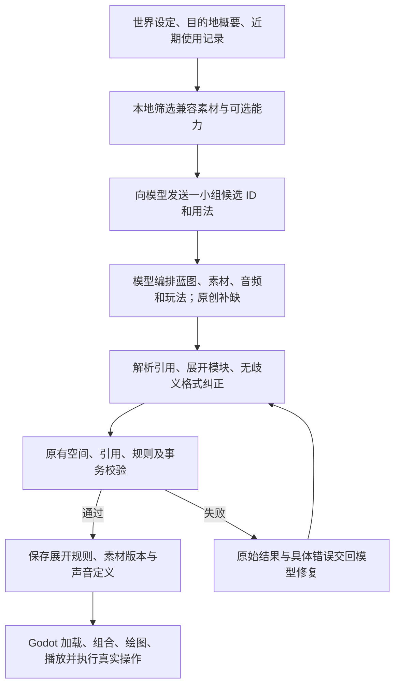

# 混合内容库

本分支让模型掌握选材、编排和创作权。库资产与可选玩法模块优先，缺少的部分继续使用原有像素绘图和有界规则 DSL；不强制每个世界套用同一战斗或初始装备。“七三开”是偏好，不是配额。

## 工作流



不增加强制规划请求，不下载模型返回的 URL，不把完整素材目录放进提示词。候选图像不超过 32 项，覆盖角色、地表、建筑、对象等用途；另提供少量音乐、常用音效和 4 个可选模块。按题材、同一像素家族、语义标签筛选，并降低近期重复图像的排序。当前检索是本地规则和标签，不是向量数据库或多轮工具代理。

## 第一批素材

425 个索引条目，总内容大小约 7.73 MB，少量同字节条目共享文件。包含 Kenney Tiny Town / Tiny Dungeon、RPG Audio / Interface Sounds，以及 4 首 CC0 音乐。原作者、版本、许可页、下载地址、包校验值见 [来源索引](../assets/library/sources.json) 与 [署名](../assets/library/CREDITS.md)。图片与 OGG 文件按 SHA-256 命名，运行时只接受索引 ID。

图像记录尺寸、俯视适配、像素家族、锚点、占地、用途和原包成员。房屋、树木大图由明确的原始瓦片数组拼接。地表还标记大面积基底、装饰点缀或墙面用途，避免模型把高对比碎石铺满整座大厅。音频记录格式、采样率、通道、时长、循环起点、作者提供的循环/节拍信息和建议增益；建议增益不等于经过响度测量。

覆盖重点是小镇与地下区域。科幻等缺少兼容图像的题材会收到空图像候选，继续原创；不能把这批素材称为全题材素材库。图像主要为静态资产，眨眼等动画可由模型叠加帧绘制。

## 图像与组合

原有 `visuals` 外壳不变，sprite 可采用以下任一种形式：

```json
{"asset":"dungeon_v1_adventurer"}
```

```json
{
  "size":[32,32],
  "parts":[{"asset":"dungeon_v1_crate","at":[8,16],"scale":1}],
  "layers":[["ellipse",11,3,10,10,"accent"],["rect",15,12,2,7,"path"]]
}
```

也支持纯 `size/layers` 绘图。库图与部件可翻转、着色；组合不超过 16 部件、画布不超过 96×96。库基础上的动画帧是叠加层，纯绘图的帧是完整图片。物品图标沿用这三种表达。模型只提供 ID，解析器补充 `asset_hash`；旧存档不会因同名资源变更而静默换图。

图像尺寸不自动创造房间。建筑的占地仍由场景明确记录，大尺寸绘图按占地中心定位，鼠标与相邻交互识别完整占地。开局必须存在 `sprites.hero` 或明确的 `bindings.hero`，随后冻结主角身份并跨区域沿用。

## 可选能力

`assets/library/modules.json` 中的模块提供输入类型、描述和导出的操作 ID：

| 模块 | 能力 |
|---|---|
| `duel_v1` | 可配置攻击、技能、防守和敌方回合 |
| `switch_door_v1` | 机关改变真实门的碰撞与外观 |
| `trade_v1` | 使用真实金币与背包的购买流程 |
| `lift_v1` | 在合法落点之间运行升降台 |

模型发送 `modules:[{module,id,args}]`，本地按实例 ID 命名空间展开为原有 `program`。原有原创规则可以继续连接这些能力。未知参数、ID 冲突与非法落点仍拒绝。存档保存展开结果、参数和模块来源哈希；加载旧世界不重新展开新版本模块。

## 音频

`region.audio.music.explore` 是地区主题，`combat` 是可选战斗主题，其他命名轨用于剧情切换。客户端以双播放器交叉淡入淡出；区域变化和战斗结束自动选择相应主题。没有音频定义的旧区域仍可播放原来的音乐。

`cues` 定义音效，`bindings` 绑定移动、交互、拾取、战斗等成功动作，`objects` 绑定具体对象的交互声音。规则可发送 `sound` 或 `music` 效果；`music:default` 恢复普通探索/战斗选择。只有事务成功提交的声音事件进入序列，客户端按序号去重，不因反复轮询或读档重放历史音效。

来源可以是库 OGG、最多三层组合、短合成音，或最多两个声部/每声部 24 音符的短乐句。模型输出音符与参数，本地发声。支持独立音乐/音效音量，M 切换音乐静音；环境声音归音效音量控制。当前没有任意音频模型生成器、分轨节拍同步或自动配器。短乐句是补缺能力，不能替代录制完整音乐的音质。

## 复现与扩库

正常启动不需要 Pillow、额外服务或下载资产。验证当前库只需标准 Python：

```powershell
py -3 tools/import_library.py --verify
```

重建原始素材包导入需要 Pillow；使用已有缓存时运行 `tools/import_library.py`，缺包时加 `--download`。下载内容与 SHA-256 已固定，不从搜索结果自动抓取任意最新版本。缓存位于忽略上传的 `userdata/library-ingest`。

新增一批已核实 CC0 的素材时，准备 PNG 或 Vorbis OGG 以及 JSON 清单：

```json
{
  "source_id":"my_reviewed_pack_v1",
  "source":{"title":"Pack title","author":"Original author","page":"https://example.com/original-pack","version":"1","license":"CC0-1.0"},
  "assets":[{"id":"my_pack_v1_floor","file":"floor.png","name":"Quiet stone floor","kind":"image","roles":["ground"],"tags":["dungeon","stone"],"family":"my_top_down_family","perspective":"top_down","footprint":[1,1]}]
}
```

```powershell
py -3 tools/register_library.py path/to/batch.json
py -3 tools/register_library.py path/to/batch.json --apply
```

第一条只预览，第二条把已审核文件、索引和来源记录入库。工具不替人判断版权真实性。图像必须与现有尺寸/视角兼容；标签需对应当前检索支持的 `town/dungeon/sci_fi` 与角色用途。复杂新视角、3D 模型或全新检索题材需要适配代码，不能仅靠入库脚本自动兼容。

维护者添加新的玩法模块时，应提供有界 DSL 模板、完整参数定义与实际数值/空间回归测试。运行时不下载或执行第三方脚本。

新世界建议使用独立 `-DataDir`。默认启用混合内容；取消连接设置中的复选框只影响后续生成，不删资产、不改变已存世界。项目当前按源码启动；如制作独立 PCK 发行包，需要将库中的原始 PNG/OGG、JSON 纳入导出文件，源码启动测试不等于发行包验收。
