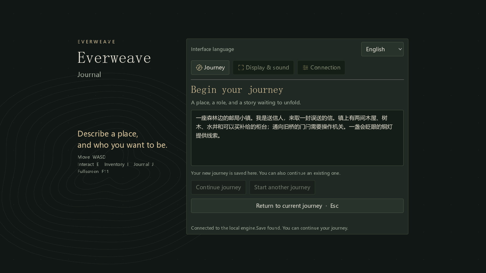
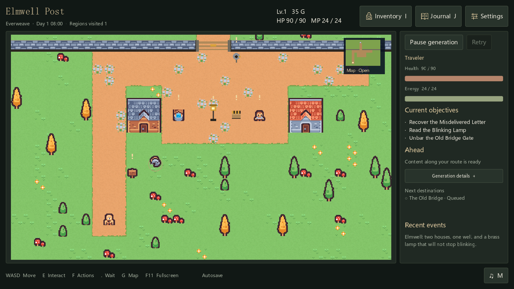

# 语言设置

开始菜单上方提供简体中文和 English 选项。游戏内打开 Settings 或设置，也可以切换语言。





## 切换范围

界面标题、按钮、物品分类、操作提示、旅图说明和通用错误提示会即时切换。已输入的世界设定、模型地址和密钥保持原样；当前存档、物品身份与任务进度不变。

模型生成的角色称谓、资源名和面板名来自保存的游戏规格，切换界面语言不会重写这份规格。已有的任务名称、剧情和对白保留原文。之后发出的生成请求使用所选语言，因此中文世界中也可能出现新生成的英文内容。已经在途的请求仍按发出时的语言完成。

切换语言不会恢复暂停的导演，也不会清空请求用量。想体验完整的英文内容，可以先选择 English，再使用独立存档开始新世界。

## 保存与实现

客户端把界面语言保存在 Godot 用户目录的 `ui-language.cfg`。生成语言通过本机的 `/language` 接口写入当前存档目录的 `settings.json`，这个接口只接受 `zh` 和 `en`。

界面文案集中在 `assets/i18n/en.json`，由 Godot TranslationServer 加载。调用 `L.t()` 的框架文字参与翻译，模型创作的文本直接使用保存值。格式参数保留在译文中，便于新增文案时进行覆盖检查。

新增语言或调整实现时，可以运行下面的测试。

```text
python -m unittest discover -s tests -p test_language.py -v
godot --headless --path . --script res://tests/i18n_smoke.gd
```

检查覆盖目录完整性、格式参数、双向切换和输入值保留，也验证语言接口不会改变世界或重置请求预算。实现使用 [Godot 的翻译服务](https://docs.godotengine.org/en/stable/classes/class_translationserver.html)。
