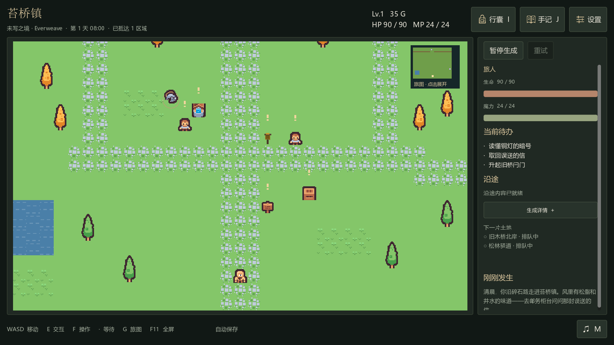
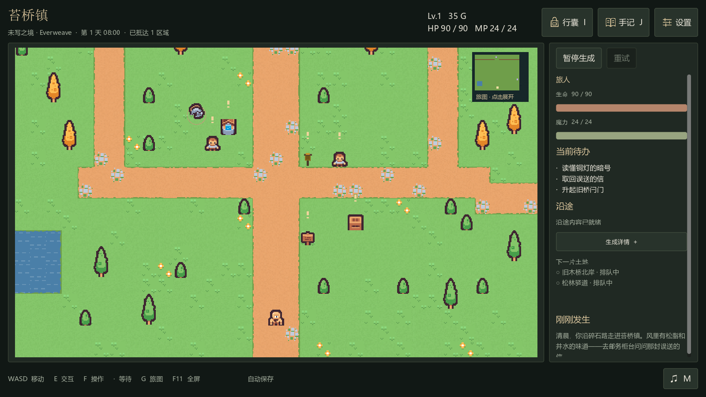
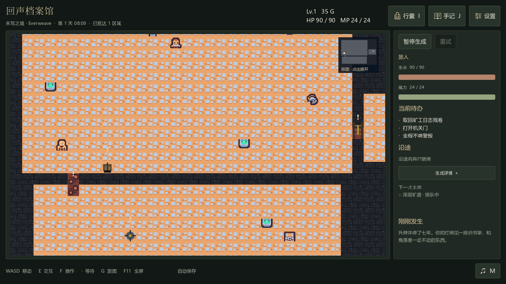
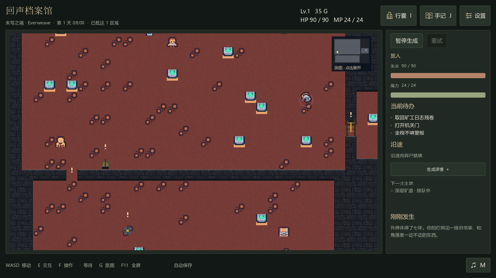
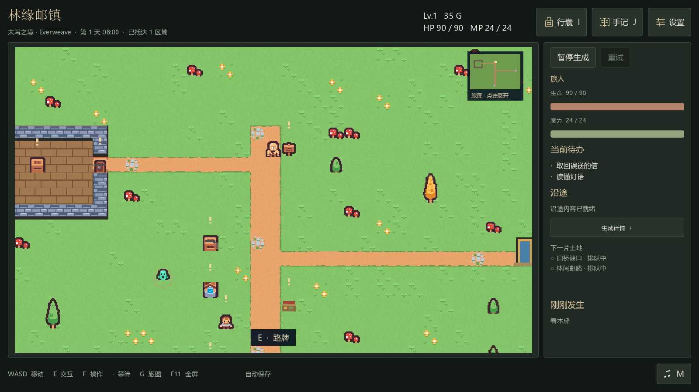

# 蓝图场景与地表修复

> 阶段说明：此文记录 a02ad4e 阶段，原开发分支已合并到 main。下述实机交互仅属于该阶段，不代表新章节医院世界完成了试玩。当前记录见 [CAMPAIGN_VALIDATION.md](CAMPAIGN_VALIDATION.md)。

在 `dfe3871` 基础上继续开发，分支仍为 `codex/hybrid-content-library`。沿用素材缓存与确定性编码方案。外部资产在忽略上传的本地缓存中恢复；六张拼接图使用确定性编码并兼容旧哈希。保留其下载列表、缓存恢复器与哈希映射；仅给壁灯索引补充 wall_front 放置语义，避免把带墙底的壁灯撒在地板上。

## 修复内容

1. `room.surface` 只写入房间内部。墙格和门格分别使用 `wall_surface`、`door_surface`，省略则使用按碰撞类型绘制的墙/门槛。动态重涂会清除旧 surface。旧存档的房间仅在对应周边格修正误用地板的显示，不全局替换相同名称的纹理，也不修改碰撞网格。
2. 增加 7 份可检索的地表材质。库图、少量兼容变体、低对比颗粒和邻接边缘由本地确定性采样完成；不增加模型调用。道路点缀移除原图草色底，木地板使用独立暖色。普通角色和道具仍使用原图，地表处理不会改写库文件。
3. 蓝图场景现在实际使用 `scenery/density`，最多布置 192 个视觉点缀。避开道路、出生点、出口、显式物体占地与交互邻域；检查完整绘制范围，点缀不带碰撞。布局改变后更新点缀，原有显式地标保留。模型把道路标为 GROUND、室内地板标为 PATH 时，可依据已知材质用途区分显示/点缀位置，逻辑类型不变。
4. 实测发现音效绑定偶尔写成 `{"asset":"..."}`，现在只在 ID 明确、类型正确且不存在冲突时就地转换为 cue 引用。其他有歧义或带未知字段的数据仍由正常校验处理。

## 同一生成结果的前后对照

未让模型重画地图来选择更好的样本。直接复用上一轮真实响应 `town-release` 与 `dungeon-repair`，在独立测试目录应用并渲染。两个场景的碰撞网格与旧快照逐格相等；追加点缀分别为 35 与 13 个，新增模型请求为 0。

| 场景 | 修改前 | 修改后 |
|---|---|---|
| 苔桥镇 |  |  |
| 回声档案馆 |  |  |

以上为保存的数据通过真实 Godot 客户端重渲染；不把静态截图生成当作交互试玩。

## 新模型输出与回归

DeepSeek Flash / low 在独立世界生成“林缘邮镇”，实际使用 4 种材质、2 个玩法模块及库图/原创叠加。原始在线流程发生一次音效格式修复，共 2 次请求、约 130.96 秒，输入 19,450、输出 32,898 tokens。补入本地纠正之后，最初那份原始响应已在零新增调用下完整应用成功；这项回放不能描述为一次新的在线成功。

示例存档使用原始响应，经材质配方解析生成。它有 48 处点缀，石墙与木地板分开显示，采用独立存档。配方在此次发布前完成了颜色/背景去除调整；存档保留完整展开定义。

验证包括：

- 234 项 Python 回归通过。新增材质引用/哈希、房间三种 surface、重涂、装饰确定性/零密度/占地保护、道路语义与碰撞不变检查。
- Godot 材质专项通过：采样稳定、纯色基底有多种颜色/变体、草地图不能遮住墙格、旧房间修正范围有限、道路细节没有整块绿底、显示类型不改写逻辑格。
- 原有 Content 与 Hybrid 原生 HTTP/客户端端到端通过，包含真实按钮命中、开门、动态操作、战斗数值、旅图和音频事件。
- 425 项本地资产缓存校验通过，无需重新下载。旧哈希兼容测试随完整回归通过。
- Computer Use 在新世界实际走到木牌旁并执行读牌交互，日志核对移动位置与操作结果；后台导演暂停，试玩未追加生成调用。

## 范围与后续

此版本改进材料如何成为完整地面，以及蓝图场景是否真正布置点缀。没有追加大量素材包或宣称已覆盖主流题材。场景结构、建筑数量、可玩内容和交互目标仍由模型设计，点缀不能代替内容密度。

边缘处理是本地邻接绘制，并未迁移到 Godot TileMap Terrain；当前也没有自动生成完整屋顶、任意复杂墙角资源或室内外遮挡系统。输入候选略有增加，没有用有限样本宣称整体延迟/成本已经稳定下降。
