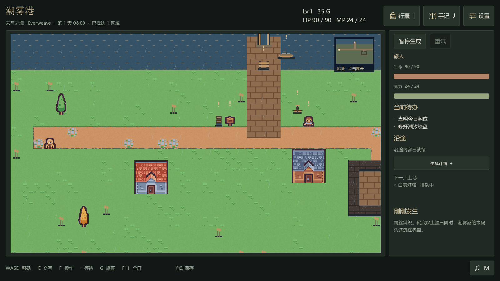
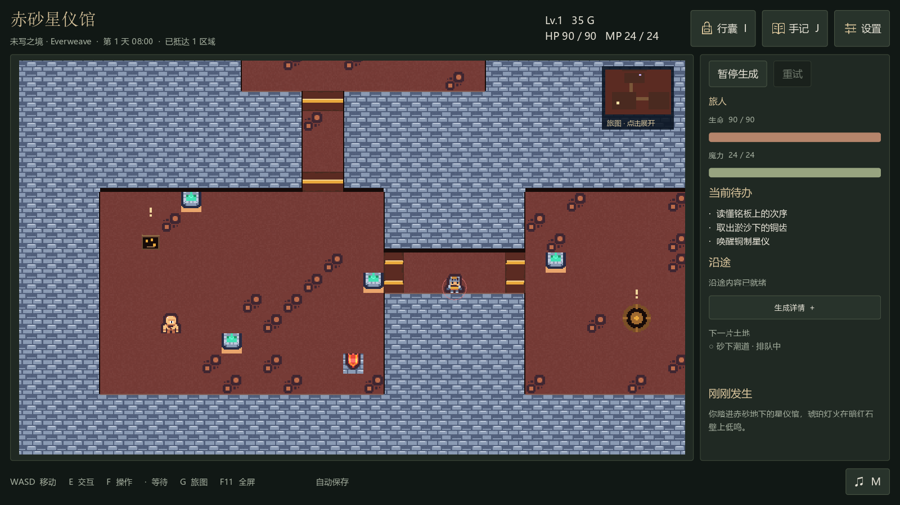
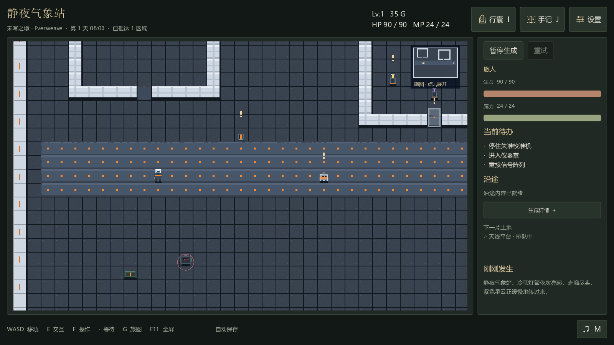

# 示例世界

这些场景于 2026-09-13 使用场景与地表实现版本 `a02ad4e` 重新生成，随后由 Godot 4.7.2 客户端渲染为 1600×900 截图。三个世界分别保存，通过引擎校验后才用于展示。

## 潮雾港

测潮员来到湿地河口的修船村。潮汐绞盘发生故障，一艘小船停在木码头，值班房和灯塔留下了维修线索。场景采用细雨、暖色木屋与灰蓝水岸。

## 赤砂星仪馆

旅人进入沙地下的古代天文馆，寻找唤醒铜制星仪的方法。陈列厅与观测室由狭窄通道连接，机械守卫守在入口附近。

## 静夜气象站

维修员前往轨道气象站回收观测记录。冷蓝金属走廊连接休眠舱与仪器室，检修机器人提供重新连接信号阵列的线索。

## 生成记录

使用 DeepSeek Flash，思考等级为 low。请求数包含失败后的定向修复，不能据此推算普遍成功率或平均费用。

| 世界 | 请求总数 | 其中修复 | 模型请求耗时合计 |
|---|---:|---:|---:|
| 潮雾港 | 3 | 2 | 约 183 秒 |
| 赤砂星仪馆 | 2 | 1 | 约 182 秒 |
| 静夜气象站 | 3 | 2 | 约 157 秒 |

生成中出现过船只无法接近、音符音高超出范围等校验错误，模型修复后通过。截图保留游戏实际生成的布局与美术，未用效果图替换。截图展示了客户端画面，不代表已经完整通关所有任务。

港湾与地下主题能复用较多现有素材；轨道站以原创绘图为主。扩充题材素材和改善场景密度仍是项目的后续工作。
